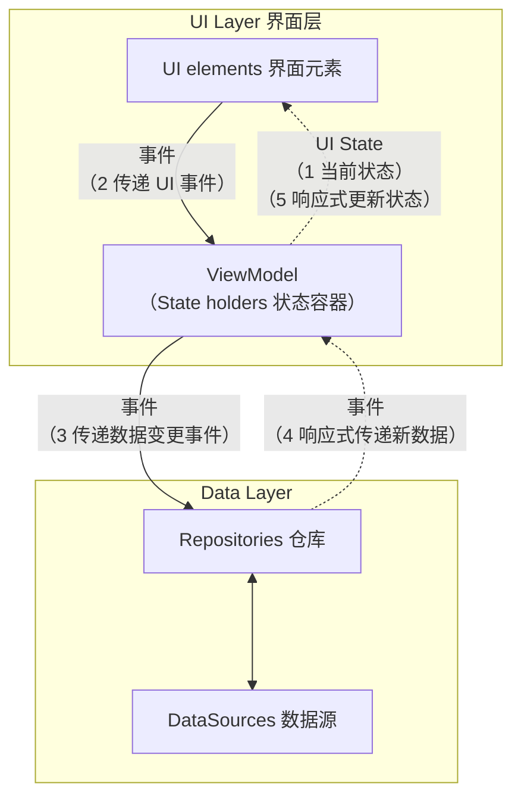
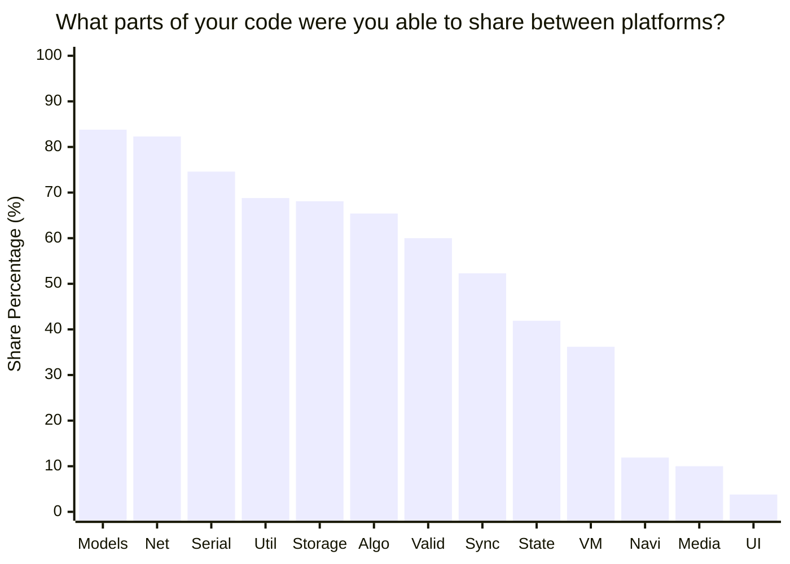
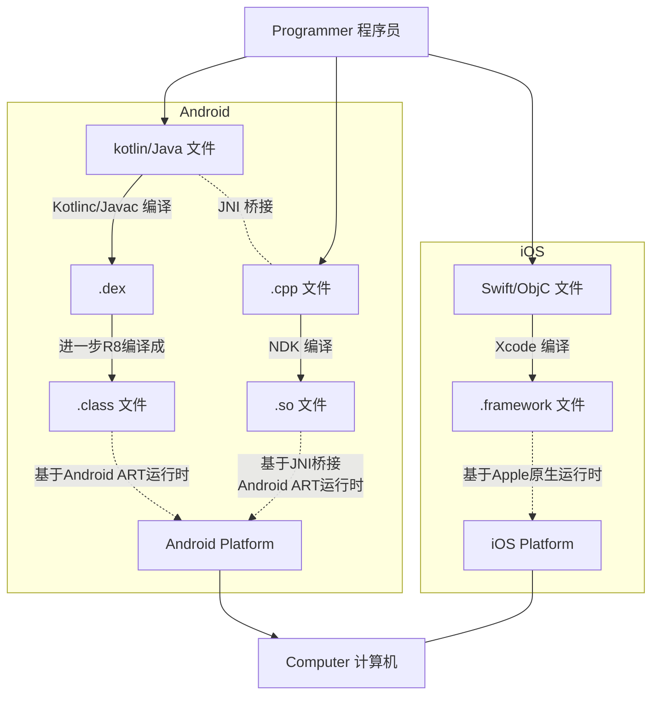
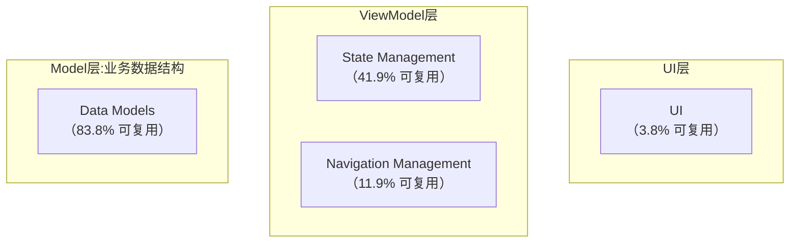
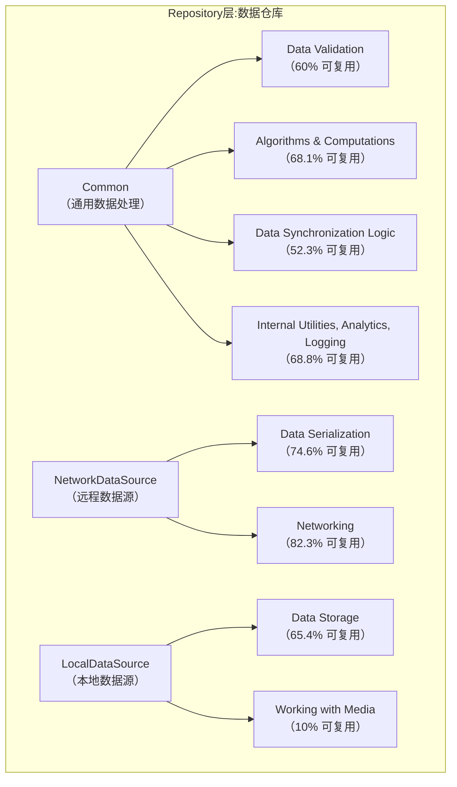

# [分享] 现代Android实践及kotlin跨平台
这篇文章需要回答哪些问题？
1. 现代 Android 开发架构的最佳实践是什么样的？和我们当前的流程/架构有哪些不同？
2. 以 Kotlin Multiplatform 为例，我们谈起跨平台时，到底是为了什么？
3. 作为视频号双端的客户端开发同学，这些实践有什么意义？这些不同中哪些对我们有价值？

这篇文章给出更多的代码示例，给出一些"扳手"，最好能够上手并提升研发体验。比起新技术，更希望大家对概念祛魅，知道何时、何地、如何用合适的工具优化特定步骤，切实的提高效率。

# 1 现代 Android 应用架构最佳实践


## 1.1 分层架构：界面层、数据层
应用开发可简单有界面、数据层两个大层，如图所示。

罗列下和这张图相关的关键词以及阐释：

> 分层（分离关注点）：好处有跨页面共享数据和逻辑、脱离页面进行单元测试等。
>
> [UI] 界面ui = 界面元素ui elements + 界面状态ui state，即界面是将屏幕上的界面元素与界面状态绑定在一起的结果。
>
> [VM] 状态容器和界面状态：应用数据和用户事件会导致界面状态随时间而变化。在状态容器中，封装了界面状态感知能力，以及更新界面状态的逻辑。
> `SwiftUI: @StateObject, Android Compose: Flow.observeAsState()`
>
> [Repo] 仓库对象：向上层公开数据，合并抽象数据源，隔离数据源的复杂度。
>
> [Data Source] 数据源对象：应仅负责处理一个数据源，数据源可以是文件、网络来源或本地数据库，是应用与数据操作系统之间的桥梁。
>

>
> 单向数据流 (UDF)：状态(数据)向上流动、事件向下流动，这种层与层的通信方式可维护性最强。
>
> 单一数据源 (SSOT)：数据只有唯一所有者，数据以不可变形式公开，外部通过公开函数、事件进行数据修改，可维护性强。
>
> 可观察/响应式数据：除开最基础的公开 api get 一次性数据，可以用响应式类库返回数据流，以实现状态向上流动。如 Kotlin Flow、RxJava 或者iOS中的 Combine、RxSwift。
>
> 依赖关系与依赖注入：常规实现中，会从上往下持有，即 View / Activity 持有 VM，VM 持有 Repo，Repo 持有 Datasource。也因此在从下往上传递状态数据时需要响应式数据流。
> 使用依赖注入可以中心化管理依赖，自动实例化并注入成员对象，方便管理和单元测试 mock。

虽然日常的模块开发中会因为历史债有很多**妥协**，但在模块设计过程中熟悉架构层级，**根据分层去拆分模块类**，让新增类或现有类的职责更单一化，是成本和可维护性间的平衡点。


## 1.2 视频号当前 Android 架构




# 2 跨端

## 2.1
很奇怪，突然画风一转聊到跨端了，先耐下性子再听我说两句。

首先，跨端也就意味着用**一套代码文件**，在某一层抽象层上开发，最终能通过编译、运行时抹平不同平台差异。广义上，C++ 通过工具链编译成 native、Java 通过编译成class以及 JVM 都实现了跨端。

而在客户端所说的跨端，更多指在iOS / Android 双端复用逻辑，因为两端差异很大，因此目前很难有让双端研发都满意的跨端方案。要么就是有运行时成本，要么就是有语言和工具链成本，要么就是生态不够成熟。

表：展示区别

```mermaid
graph TD

```

针对双端的跨端，我们有很多可操作的空间，从抽象层面，程序员通过编码让计算机执行指令，而不同的编译工具链、运行时仅仅是针对不同编码中间态的转换。

图：从程序员到计算机的编码、编译、解释流程




同时，跨端复用同样也可以分为界面和数据层两层，这里需要根据选型





## 2.2 灵魂拷问

- 给一个最直接的理由：
- 为啥不用 C++：这个问题好回答，因为反过来说，如果 C++万能，那么 Swift 和 Java 就没有意义，更高层的抽象就没了意义。所以，抛开具体的需求（或者说代码层级）讲语言没有太大意义，要具体问题具体分析。

- 为啥不用 Flutter，这个问题比较复杂。
  从我个人的观察，引入新技术，不论小到类库，大到运行时，最终都是需要落到研发体验上，才能谈意义。
    - 而为了改善研发体验，增加**代码逻辑复用**，而增加了代码**架构复杂度**
    - （复杂度不致命，致命的是又无法很好的封装，使得复杂度透明）
    - 同时还增加了**工具链的复杂度**，最可怕的是更长的编译运行流程带来的黑箱，使得问题排查变得更痛苦

- 具体到需求，这个功能怎样决策用什么技术栈，不同选型的边界在哪？


# 3 当我们忙着搞需求了，这些还有啥意义？

意义在于，想明白了哪些是我们真正的痛点，就可以针对性的采用稳定的工具链去尝试单点优化。


在需求开发过程中，最影响研发体验的要素，或者说痛点，按重要程度排序如下：

1. 因为架构、历史债导致


## 3.1 最佳实践

我现在有个需求，基于现有的工程现状，要采用 flutter 技术栈开发 ui 层。

- [ ] todo , 查看一个 flutter 需求所涉及的代码，看下是否有重复代码，可以通过 kotlin multiplatform 复用

## 3.2 漫谈

Android 技术栈中最有价值的部分其实几乎与 Java 分不开，借助了 Java 的生态才有了坚实的基础和环境， kotlin 这样的新语言借助 JVM 站稳脚跟后，也有了新发展。

有了新发展，落到实际需求中，

# 附录
[微信的跨平台业务开发概述 - 腾讯iWiki](https://iwiki.woa.com/p/1773286994)

[Klibs.io — Search 2200+ KMP projects](https://klibs.io/)


[应用架构指南  |  App architecture  |  Android Developers](https://developer.android.google.cn/topic/architecture?hl=zh-cn)

[有关 Android 架构的建议  |  App architecture  |  Android Developers](https://developer.android.google.cn/topic/architecture/recommendations?hl=zh_cn)

[android/nowinandroid: A fully functional Android app built entirely with Kotlin and Jetpack Compose](https://github.com/android/nowinandroid)

[ 率先适配 iOS 26 “液态玻璃”，腾讯 Kuikly 正在探索 KMP 的全新可能！｜社区分享](https://mp.weixin.qq.com/s/Y9sDJbkoW8G3aiDduvEnlA)

[Multiplatform journal - JetBarins](https://www.jetbrains.com/help/kotlin-multiplatform-dev/cross-platform-mobile-development.html)